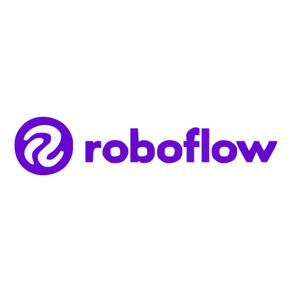

# Copag Monitoring System

<div align="center">
  <h3>Technology Stack</h3>
  
  
  
  
  
  
</div>

<div align="center">
  
  
  
  
  
  
</div>

<div align="center">
  <h3>Real-time Driver Distraction Detection System</h3>
  <p>Advanced AI-powered monitoring solution for driver safety and behavior analysis</p>
</div>

---

## Overview

The Copag Monitoring System is a comprehensive driver safety solution that combines cutting-edge computer vision, real-time analytics, and modern web technologies to detect and prevent driver distraction incidents. Built with React, FastAPI, and Roboflow's inference pipeline, it provides instant alerts and detailed behavioral insights.

## Key Features

### Real-time Detection
- **Distraction Detection**: Advanced AI models identify various driver distraction behaviors
- **Behavioral Analysis**: Comprehensive monitoring of driver attention and focus
- **Instant Alerts**: Real-time notifications for safety violations
- **Performance Metrics**: Detailed analytics and safety scoring

### Modern Technology Stack
- **Frontend**: React 18 with TypeScript, Vite build system, and Tailwind CSS
- **Backend**: FastAPI with WebSocket support for real-time communication
- **AI/ML**: Roboflow inference pipeline for ultra-fast object detection
- **Notifications**: Telegram Bot integration for instant alerts
- **UI/UX**: Modern dashboard with shadcn/ui components and responsive design

## Architecture

```
┌─────────────────┐    ┌─────────────────┐    ┌─────────────────┐
│   Frontend      │    │   Backend       │    │   AI Pipeline  │
│   (React/Vite)  │◄──►│   (FastAPI)     │◄──►│   (Roboflow)    │
│                 │    │                 │    │                 │
│ • Dashboard     │    │ • WebSocket     │    │ • Model:        │
│ • Real-time UI  │    │ • REST API      │    │   driver-       │
│ • Analytics     │    │ • State Mgmt    │    │   behaviour     │
│ • Alerts        │    │ • CORS Support  │    │ • Real-time     │
└─────────────────┘    └─────────────────┘    │   Inference     │
                                              └─────────────────┘
                                                       │
                                              ┌─────────────────┐
                                              │   Telegram Bot  │
                                              │                 │
                                              │ • Instant Alerts│
                                              │ • Notifications │
                                              │ • Status Updates│
                                              └─────────────────┘
```

## Technology Stack

### Frontend Technologies
- **React 18.3.1** - Modern UI library with hooks and concurrent features
- **Vite 5.4.19** - Lightning-fast build tool and development server
- **TypeScript 5.8.3** - Type-safe JavaScript development
- **Tailwind CSS 3.4.17** - Utility-first CSS framework
- **shadcn/ui** - High-quality, accessible component library
- **Framer Motion 12.23.24** - Advanced animations and transitions
- **Socket.IO Client 4.8.1** - Real-time bidirectional communication

### Backend Technologies
- **FastAPI 1.0.0** - Modern, fast web framework for building APIs
- **WebSocket Support** - Real-time bidirectional communication
- **CORS Middleware** - Cross-origin resource sharing
- **Uvicorn** - ASGI server for production deployment

### AI/ML Technologies
- **Roboflow Inference** - Ultra-fast computer vision inference
- **OpenCV** - Computer vision and image processing
- **Custom Model**: `driver-behaviour-ge5cr/1` - Specialized driver behavior detection

### Additional Tools
- **Telegram Bot API** - Instant notifications and alerts
- **Socket.IO** - Real-time event-based communication
- **ESLint** - Code quality and consistency
- **PostCSS** - CSS processing and optimization

## Installation

### Prerequisites
- Node.js 18+ and npm/yarn
- Python 3.8+ with pip
- Git for version control

### Frontend Setup
```bash
cd frontend
npm install
npm run dev
```

### Backend Setup
```bash
# Create virtual environment
python -m venv venv
source venv/bin/activate  # On Windows: venv\Scripts\activate

# Install dependencies
pip install fastapi uvicorn websockets python-socketio

# Run the server
python backend/main.py
```

### AI Model Setup
```bash
# Install Roboflow inference
pip install inference

# Configure API key in stream_model.py
# Run the detection pipeline
python stream_model.py
```

## Project Structure

```
Copag Mon. Sys/
├── frontend/                 # React application
│   ├── src/
│   │   ├── components/       # Reusable UI components
│   │   │   ├── Dashboard/   # Dashboard-specific components
│   │   │   └── ui/          # Base UI components (shadcn/ui)
│   │   ├── hooks/           # Custom React hooks
│   │   ├── pages/           # Application pages
│   │   └── lib/             # Utility functions
│   ├── public/              # Static assets
│   └── package.json         # Dependencies and scripts
├── backend/                 # FastAPI server
│   ├── main.py              # Main application file
│   └── run.py               # Server runner
├── stream_model.py          # AI inference pipeline
├── .gitignore              # Git ignore rules
└── README.md               # Project documentation
```

## API Endpoints

### WebSocket Endpoints
- `ws://localhost:8000/ws` - Real-time communication channel

### REST API Endpoints
- `GET /` - Root endpoint with system information
- `GET /health` - Health check endpoint
- `GET /stats` - System statistics and monitoring status
- `POST /start` - Start monitoring session
- `POST /stop` - Stop monitoring session

## Configuration

### Environment Variables
Create a `.env` file in the root directory:

```env
# Roboflow Configuration
ROBOFLOW_API_KEY=your_api_key_here
MODEL_ID=driver-behaviour-ge5cr
MODEL_VERSION=1

# Telegram Bot Configuration
TELEGRAM_BOT_TOKEN=your_bot_token_here
TELEGRAM_CHAT_ID=your_chat_id_here

# Server Configuration
BACKEND_HOST=0.0.0.0
BACKEND_PORT=8000
FRONTEND_PORT=3000
```

## Development

### Running in Development Mode
```bash
# Terminal 1: Start backend
cd backend
python main.py

# Terminal 2: Start frontend
cd frontend
npm run dev

# Terminal 3: Start AI pipeline
python stream_model.py
```

### Building for Production
```bash
# Build frontend
cd frontend
npm run build

# The built files will be in frontend/dist/
```

## Features in Detail

### Dashboard Components
- **Real-time Video Feed** - Live camera stream with AI overlay
- **Safety Score** - Dynamic safety rating based on behavior
- **Behavior Charts** - Visual analytics of driver patterns
- **Alerts Panel** - Real-time notifications and warnings
- **System Status** - Health monitoring and connection status
- **AI Insights** - Machine learning-powered recommendations

### AI Detection Capabilities
- **Distraction Detection** - Identifies phone usage, eating, etc.
- **Attention Monitoring** - Tracks driver focus and alertness
- **Behavioral Patterns** - Learns and adapts to driver habits
- **Risk Assessment** - Calculates safety scores and risk levels

## Contributing

1. Fork the repository
2. Create a feature branch (`git checkout -b feature/amazing-feature`)
3. Commit your changes (`git commit -m 'Add some amazing feature'`)
4. Push to the branch (`git push origin feature/amazing-feature`)
5. Open a Pull Request

## License

This project is licensed under the MIT License - see the [LICENSE](LICENSE) file for details.

## Support

For support and questions:
- Create an issue in the GitHub repository
- Contact the development team
- Check the documentation for troubleshooting

---

<div align="center">
  <p>Built with ❤️ for driver safety and road security</p>
  <p>© 2024 Copag Monitoring System. All rights reserved.</p>
</div>